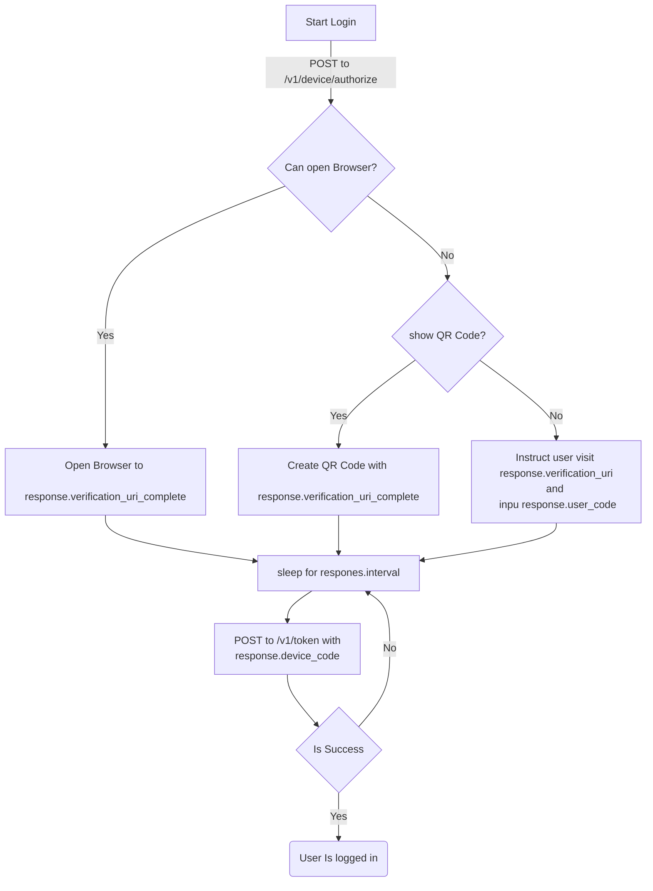

OAuth Device Grant Example
==========================

Quick ~100 line bash implementation of the [OAuth Device Code Grant](https://oauth.net/2/grant-types/device-code/).

The device code grant type is used by browserless or input-constrained devices, such as Smart TVs, alarm clocks, CLI tools, etc.

Prerequisites to running this script:

* [`jq`](https://stedolan.github.io/jq/)
* (Optional, used to generate QR Code) [qrencode](https://fukuchi.org/works/qrencode/index.html.en) - [homebrew](https://formulae.brew.sh/formula/qrencode)

> Implementation note: This script assumes an OpenID Connect (OIDC) identity provider (IdP). As it makes use of OIDC Discovery (`${issuer}/.well-known/openid-configuration`)

## How to use

Clone this repo:

```bash
git clone https://github.com/bdemers/oauth-device-code-grant-bash-example.git
cd oauth-device-code-grant-bash-example
```

If your OAuth IdP is Okta, you can use the [Okta CLI](https://cli.okta.com/) and run:

> NOTE: Support for the Device Code Grant is only available in a PR currently: https://github.com/okta/okta-cli/pull/394

```bash
okta start
./token.sh
```

If you are using a different IdP, or the Okta CLI, the script can be run by passing your OAuth client-id and issuer to the script:

```bash
./token.sh <client-id> <issuer>
```

Then follow the instructions in your terminal.


## Device code grant flow diagram


